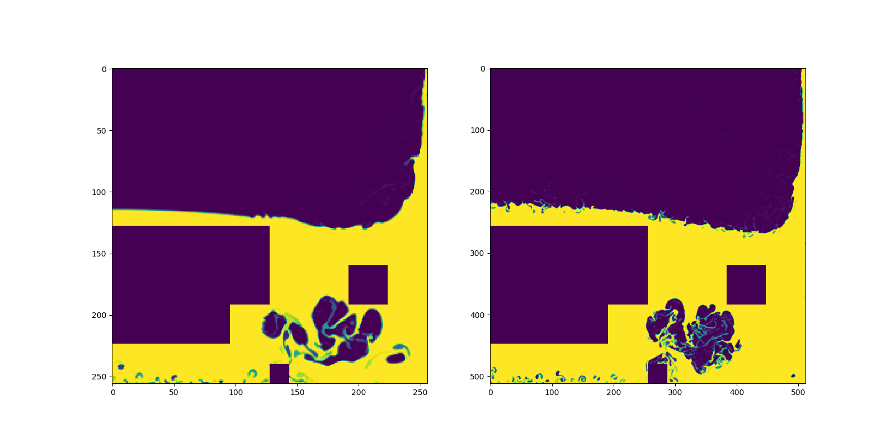
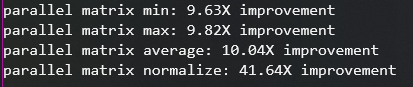
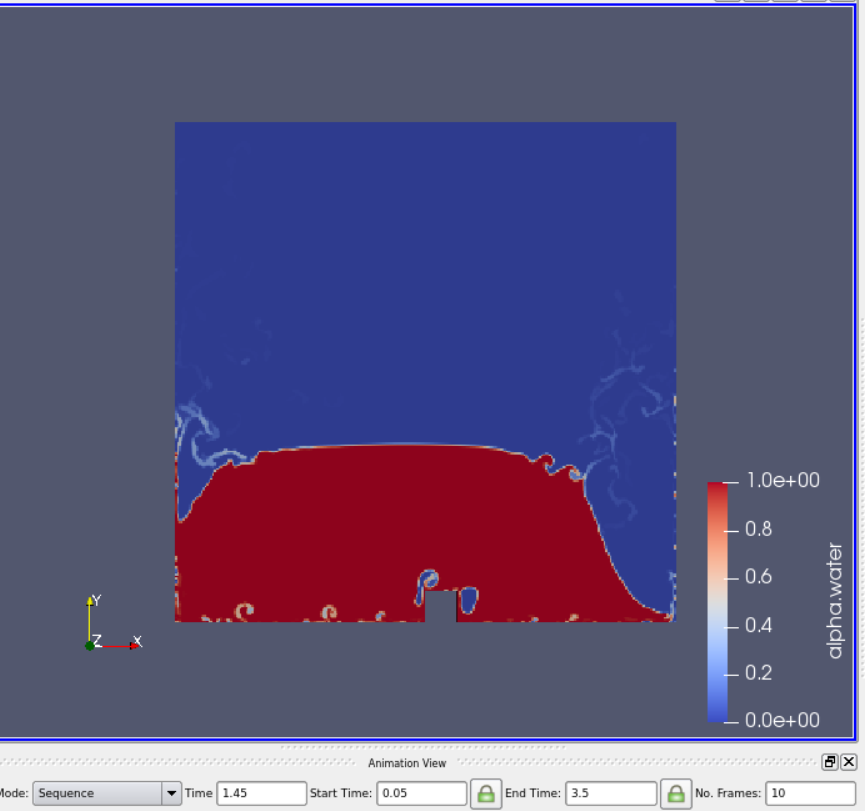
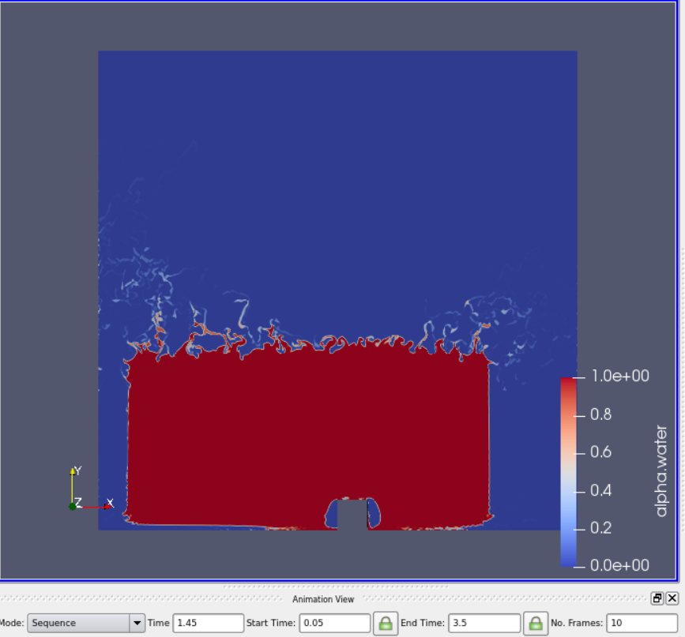
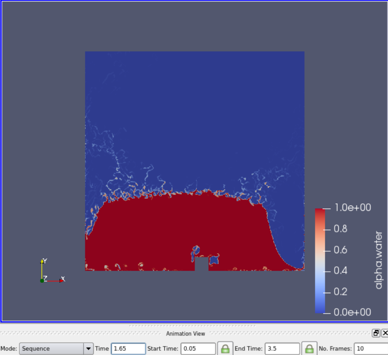

# SRCFD
#### Matthew Li
mwl5628@psu.edu

Hello there!

This repo contains all the components for a Super Resolution in Computation Fluid Dynamics project, with data processing as well as network training and testing.

CFD is very important in the field of engineering, but solving CFD problems can be very computationally
intensive. It is a problem that cannot be easily scaled to more CPU or GPU cores making it very difficult to parallelize. This project proposes a novel method of solving CFD problems by applying a neural network super-resolution to lower resolution CFD simulations.
 
 
 
 
 

## Table of Contents

[Updates](#update)

[The OpenFOAM CFD platform](#openfoam)

[Data](#data)

[The Neural Network](#NN)

 
 
 
 
 

## Updates

#### 4/9/2020
My apologies for not updating this repository in quite a while! This project was on the backburner for some time, but this update will be quite substantial, as you can read below.

##### A move to a much (much) higher resolution for simulations
After some experimentation and running the dambreak case at varying resolutions, I came to the conclusion that running simulations at a substantially higher resolution (64x64->512x512) may provide better results. The higher resolution simulations have much more information, and I believe that may be key to creating better data for a neural network.

Running simulations at high resolution also led me to realize that the problem I am trying to solve is fundamentally different from traditional image super-resolution. There is no direct correspondence between features, making this problem significantly more difficult.

https://i.imgur.com/KnEuS6M.gif

##### A more efficient hybrid approach for neural net training and inference
After running the openFOAM simulations at a higher resolution, I realized that in most cases, a significant amount of every frame had large areas of solid colors (completely air or completely water), and that a neural network shouldn't be needed to upscale these. I could simply use nearest-neighbor upscaling instead. This means that within a given frame, only a portion of it needs to be inferred by a neural network, which could drastically cut down on computation cost.

I want the neural network to focus on "features", which are areas in frames where the water is interacting with the air. My approach to find these features was dividing each frame into smaller squares and removing those which
exceed a certain threshold of water or air. The size of these squares is the "feature size", and the optimal feature size will be determined by experimentation. (Note: the small blank square at the bottom in the middle is the dam)

##### A major restructuring of code
My utils.py file was becoming quite large and bulky, so I decided to organize all the functions into more specific files. There is also
a new file that sets all the relevant file paths based on the operating system. This restructuring should hopefully make this project
easier to navigate through and use.

##### Optimizing code using parallelism
After writing some matrix functions, I realized that my code could benefit signicantly from parallelism. I used a python library called Numba, which can provide jit compilation using a decorator, as well as automatic parallel compilation. Comparing it to my non-compiled, non-parallel code, there is a significant improvement in speed, as you can see. However, an interesting thing to note is that the max, min, and avg functions don't seem to benefit from the parallel optimizations. These use numpy routines, and it has led to the conclusion that these numpy routines already execute in parallel.

##### A time desynchronization problem
Moving to a higher resolution also revealed a very interesting issue with OpenFOAM. To illustrate this problem, here is the same case at the same time step, with one at 256x256 resolution and the other at 512x512 resolution, rendered in ParaView.

|||
|-|-|

Here is the same 512x512 simulation at a slightly later time step.

As you can see, the higher resolution simulation lags behind. I have confirmed that the two cases have the same initial conditions. After some experimentation, it seems that every case is affected. As you might imagine, this is quite a significant problem for this project. I am still trying to find the cause of this problem, as I do not have enough CFD knowledge to understand it.

#### 7/20/2019
3D dambreak work put on hold due to extremely long execution time and unexpected and unexplainable fluid behavior. Extending blocks in Z direction may not be sufficient to make the sim 3D.

Began working on "over time" SRCFD. I theorized that feeding a neural network multiple frames of data at a time may produce better results, since multiple frames may allow a NN to extrapolate more information about the fluid's general behavior. A
plot of such a 3D array will be attached below.

I am also interested in 3D-printing a model of such a fluid sim over time as a neat visualization of my work. I need to convert a numpy voxel grid to an STL compatible mesh. I used the marching cubes algorithm from SKlearn and got this as a
result. I think it looks quite neat but I feel like not having cubes makes it lose the sense of "resolution". Will experiment further.

|||
|-|-|

#### 7/2/2019
Started work with 3D dambreak. Modified the blockMeshDict file of one case to be extended in the Z direction. Plotted results in matplotlib and made gifs; can be found in the gifs folder. Produced some unexpected results. Running the interFoam solver took much much longer than the 2D case.

 
 
 
 
 

## The OpenFOAM CFD platform

CFD data was gathered from simulations run in the OpenFOAM software platform. The data used in this project comes from the OpenFOAM dambreak tutorial (https://cfd.direct/openfoam/user-guide/v6-dambreak/), which was modified to have uniform point density as well as randomized fluid properties.

### OpenFOAM file format
The most essential files for an OpenFOAM simulation are the blockMeshDict, controlDict, as well as g, transportProperties, and turbulenceProperties. blockMeshDict defines the geometry of the simulation, controlDict defines the time properties, and other 3 modify
fluid properties. An example folder has been included that contains all of these files and more.

### BlockMeshDict
The geometry of an OpenFOAM simulation is made up of rectangular blocks, defined by a set of vertices. Each block contains a set of vertices as well and a point density.

Vertices List for a sample blockMeshDict

Block List for a sample blockMeshDict

Each block consists of a set of vertices and a set of block densities for the x,y,z directions.

 
 
 
 
 

## Data
The data comes from files in each timestep directory that the solver produces. This comes in the form of a list of points that must
be assembled from left to right, bottom to top. This makes the assembly slightly more complicated.

For example, if we had a block of 8 points, it would be assembled like this:

Blocks can have an arbitrary amount of points, and each scene can have an arbitrary amount of points, so processing the CFD data
into a usable format for the neural net was a nontrivial problem. The algorithm for doing this can be found in utils.py.

Each case was ran for 5 seconds, with timesteps of 0.05, and both a highres and lowres version. 400
different cases were ran, each with two versions of 101 data points each, resulting in 80,800 total data points.

#### Low-res vs High-res data

|| |
|-|-|

 
 
 
 
 

## The Neural Network
The network architecture of this project has not been 100% finalized yet, but so far we have been experimenting with existing image SR CNN architectures. The one used currently as of \[7/1/2019\] is FSRCNN from the Chinese University of Hong Kong (http://mmlab.ie.cuhk.edu.hk/projects/FSRCNN.html) which has been very straightforward to implement. The FSRCNN was implemented in Keras with the Tensorflow backend. This code, along with more information, can be found in the neural net folder.
