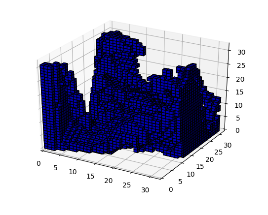
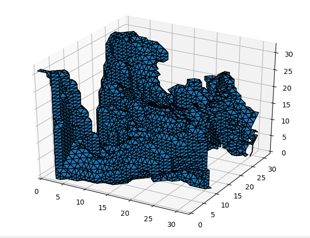
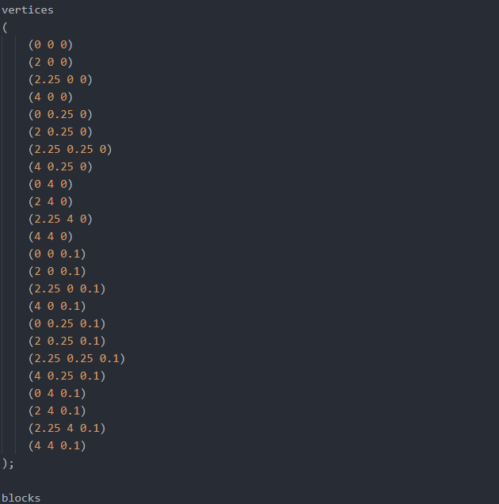
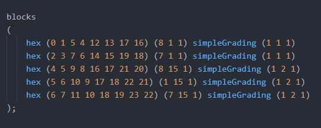
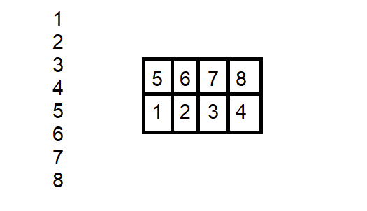
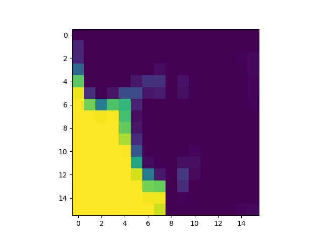
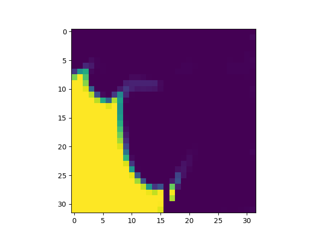

# SRCFD
#### Matthew Li
mwl5628@psu.edu

Hello there! 

This repo contains all the components for a Super Resolution in Computation Fluid Dynamics project, with data processing as well as network training and testing. 

CFD is very important in the field of engineering, but solving CFD problems can be very computationally
intensive. It is a problem that cannot be easily scaled to more CPU or GPU cores making it very difficult to parallelize. This project proposes a novel method of solving CFD problems by applying a neural network super-resolution to lower resolution CFD simulations.

## Table of Contents

[Updates](#update)

[The OpenFOAM CFD platform](#openfoam)

[Data](#data)

[The Neural Network](#NN)

<a name="update"</a>
## Updates

#### 7/20/2019
3D dambreak work put on hold due to extremely long execution time and unexpected and unexplainable fluid behavior. Extending blocks in Z direction may not be sufficient to make the sim 3D.

Began working on "over time" SRCFD. I theorized that feeding a neural network multiple frames of data at a time may produce better results, since multiple frames may allow a NN to extrapolate more information about the fluid's general behavior. A
plot of such a 3D array will be attached below.

I am also interested in 3D-printing a model of such a fluid sim over time as a neat visualization of my work. I need to convert a numpy voxel grid to an STL compatible mesh. I used the marching cubes algorithm from SKlearn and got this as a 
result. I think it looks quite neat but I feel like not having cubes makes it lose the sense of "resolution". Will experiment further.

#### 7/2/2019
Started work with 3D dambreak. Modified the blockMeshDict file of one case to be extended in the Z direction. Plotted results in matplotlib and made gifs; can be found in the gifs folder. Produced some unexpected results. Running the interFoam solver took much much longer than the 2D case.

## The OpenFOAM CFD platform

CFD data was gathered from simulations run in the OpenFOAM software platform. The data used in this project comes from the OpenFOAM dambreak tutorial (https://cfd.direct/openfoam/user-guide/v6-dambreak/), which was modified to have uniform point density as well as randomized fluid properties.

### OpenFOAM file format
The most essential files for an OpenFOAM simulation are the blockMeshDict, controlDict, as well as g, transportProperties, and turbulenceProperties. blockMeshDict defines the geometry of the simulation, controlDict defines the time properties, and other 3 modify
fluid properties. An example folder has been included that contains all of these files and more.

### BlockMeshDict
The geometry of an OpenFOAM simulation is made up of rectangular blocks, defined by a set of vertices. Each block contains a set of vertices as well and a point density.

Vertices List for a sample blockMeshDict

Block List for a sample blockMeshDict

Each block consists of a set of vertices and a set of block densities for the x,y,z directions.

## Data
The data comes from files in each timestep directory that the solver produces. This comes in the form of a list of points that must
be assembled from left to right, bottom to top. This makes the assembly slightly more complicated.

For example, if we had a block of 8 points, it would be assembled like this:

Blocks can have an arbitrary amount of points, and each scene can have an arbitrary amount of points, so processing the CFD data
into a usable format for the neural net was a nontrivial problem. The algorithm for doing this can be found in utils.py.

Each case was ran for 5 seconds, with timesteps of 0.05, and both a highres and lowres version. 400
different cases were ran, each with two versions of 101 data points each, resulting in 80,800 total data points.

#### Low-res vs High-res data

|| |
|-|-|

## The Neural Network
The network architecture of this project has not been 100% finalized yet, but so far we have been experimenting with existing image SR CNN architectures. The one used currently as of \[7/1/2019\] is FSRCNN from the Chinese University of Hong Kong (http://mmlab.ie.cuhk.edu.hk/projects/FSRCNN.html) which has been very straightforward to implement. The FSRCNN was implemented in Keras with the Tensorflow backend. This code can be found in the file FSRCNN.py.
enen
