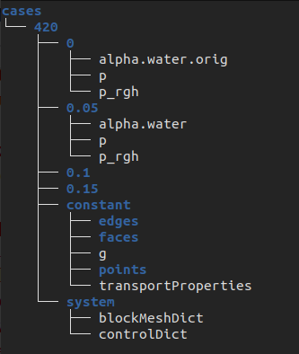
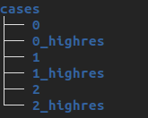

# Utilities

This folder contains pieces of code I wrote to help me at various stages in the project. Each file will have comments, but
additional information will be in this readme as well. First, I will explain some details about the structure of the project.
 
 
 
### The file structure

OpenFOAM has a nested file structure for each simulation case. Within the folder for an individual simulation, there will be
a folder for each timestep, a folder for constant properties, and a folder for system properties, like this:

The name of the case is just a number, and each case has a lowres and a highres version. Such a directory of caes can be generated by copying the original dambreak case and renaming each one. I put all the case directories in a single directory like this:

__This is important because some of the code in this folder will not work if the files are not organized in this way!__
 
 
 
### Naming Files

I have chosen a very specific naming format for the .npy and .jpg files generated for this project, mainly for ease of sorting
by chronological order.

__0_highres-32x32x1-alpha.water-0.1.npy__
 
__0_highres-32x32x32-alpha.water-0.1-3D-2.jpg__

The order is as follows:

_[case number] [ _highres(leave empty if lowres)]-[resolution]-[data file]-[time step].[file type]__

The jpg files also have an extra integer number before the file extension that signifies order, as these images are intended
for animating in order.

